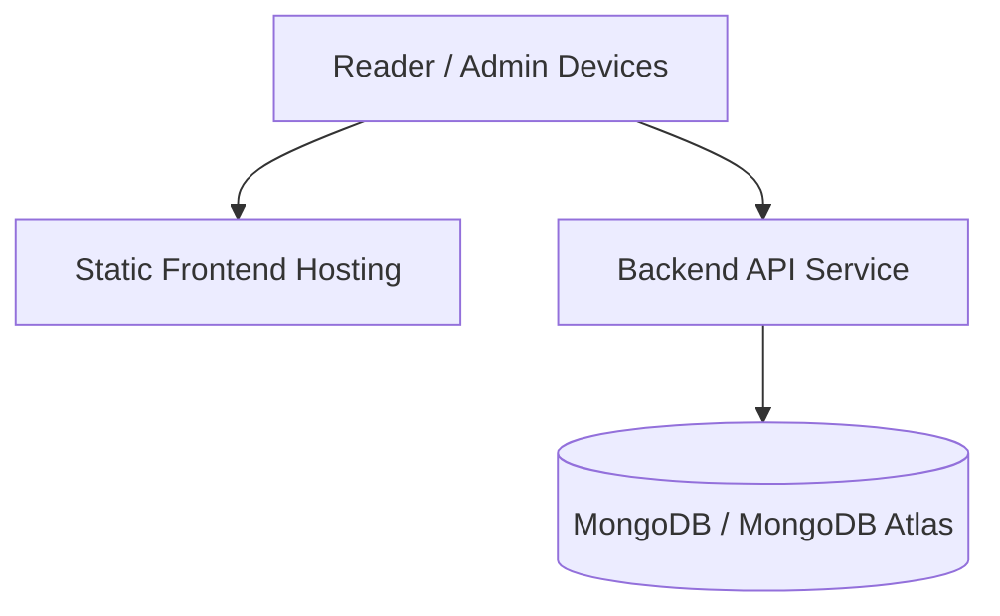

# HKids Technical Architecture

Last updated: February 10, 2026

## 1. Architecture Overview

HKids follows a modular web architecture:

- React client for reading and back-office workflows
- Express REST API for domain logic and access control
- MongoDB for content and profile data persistence

```mermaid
flowchart LR
  R[Reader UI\nReact + Vite] -->|Public API| API[Express API\nTypeScript]
  B[Back-office UI\nReact + Vite] -->|Admin API + JWT| API
  P[Parent Portal Flows\n(API consumers)] -->|Parent API + Parent JWT| API
  API --> DB[(MongoDB)]
```

## 2. Backend Module Boundaries

The API is split by domain to support maintainability and future extension:

- `auth`: admin/editor authentication and session checks
- `books`: book CRUD, publication workflow, filtering
- `categories`: category CRUD and ordering
- `parent/auth`: parent registration/login
- `parent`: child profiles, pairing code creation, device assignment
- `public`: reading endpoints, pairing claim, reader usage tracking

Cross-cutting layers:

- validation (`zod`)
- rate limiting
- request logging
- auth middleware and role checks
- centralized error handling

## 3. Core Flows

### 3.1 Public Reader Flow

1. Reader client requests `/api/public/books` and `/api/public/categories`.
2. Server returns only published content and applies filters.
3. If a paired device id is supplied, server injects child-age filtering.
4. Book page navigation happens client-side with server-provided page assets.

### 3.2 Back-office Content Flow

1. Admin/editor logs in via `/api/auth/login`.
2. JWT token is used for `/api/admin/*` endpoints.
3. Editors manage drafts and updates.
4. Admin publishes or archives books.

### 3.3 Parent Pairing and Reading Limits

1. Parent creates child profiles (`/api/parent/children`).
2. Parent generates short-lived pairing codes (`/api/parent/devices/pairing-codes`).
3. Reader device claims code (`/api/public/pairing/claim`).
4. Reader usage is tracked (`/api/public/reader/usage`) and daily limits are enforced.

## 4. Data Model Summary

Main entities:

- `User` (admin/editor)
- `Parent`
- `ChildProfile`
- `Device`
- `PairingCode`
- `Book`
- `Category`

Notable constraints:

- unique email per admin/parent account
- unique pending pairing code key
- per-device daily usage counters
- book status lifecycle: `draft -> review -> published -> archived`

## 5. Security and Reliability

Implemented controls:

- JWT authentication for admin/editor and parent domains
- role-based authorization for admin endpoints
- in-memory global and auth-specific rate limiting
- schema validation at API boundaries
- CORS allow-list configuration
- centralized error response format

Current reliability profile:

- stateless API process
- graceful shutdown hooks
- health endpoint for liveness checks

## 6. Deployment Model

Target deployment is container-friendly and hardware-agnostic:



Suggested production baseline:

- static hosting/CDN for `client`
- containerized Node API for `server`
- managed MongoDB (Atlas or equivalent)
- TLS termination at ingress/load balancer
- reference profile in this repo: `deploy/docker-compose.tablet.yml`

## 7. Hardware Independence Assumptions

The architecture avoids hard coupling with a specific device vendor:

- UI delivered as standard web app
- only requires a modern browser/webview runtime
- no native-only APIs in critical path
- API and storage decoupled from device firmware

See `docs/HARDWARE_INTEGRATION_ASSUMPTIONS.md` for explicit assumptions and recommended minimum specs.

## 8. Extension Points

Planned features can be added with minimal structural changes:

- audio narration per page (`pages.audioUrl` + reader controls)
- parental dashboard (usage analytics endpoints + charts)
- offline reading packs (asset caching + sync protocol)
- moderation workflow states beyond publish/archive
